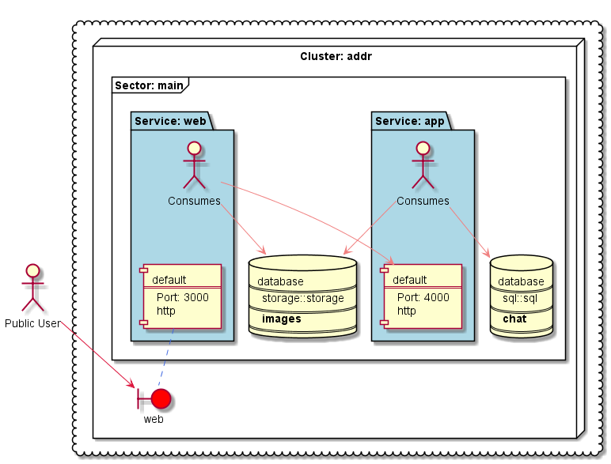

# Berlioz Sample - GCP Chat

This is a sample application with 2 microservices:

* **WEB**: A web frontend written in Node.js. **WEB** talks to **APP**.
* **APP**: A backend service written in Node.js. **APP** writes to **DB** like MySQL and Google Cloud Storage.
* **DB**: A MySQL Database(to store plain text information).
* **DB**: A Google Cloud Storage Database(to store images).

We deploy this application using Berlioz to local computer, and to the cloud as well.  

- **Requirements**

	1. Request a [demo](https://berlioz.cloud/#demo)
	2. Install a [node.js](https://nodejs.org)
	3. Install [berlioz CLI](https://www.npmjs.com/package/berlioz) `npm install berlioz -g --unsafe-perm`
	4. Install a [graphviz](http://www.graphviz.org/download)
	5. Install a [docker](https://www.docker.com/)
	6. Create a key with owner permission in [Google Cloud IAM ](https://console.cloud.google.com/iam-admin/iam)
	7. Run: `git clone https://github.com/johnbalvin/berliozchat.git sample.git`
	8. Run:  `cd sample.git`

- **Local computer**

	1. Run : `berlioz local provider gcp set --key-path credentials.json` to assing the credentials locally
	2. Run : `berlioz local build-run`
	3. Go to : [http://127.0.0.1:40000](http://127.0.0.1:40000)
	4. **(IMPORTANT WHEN YOU FINISHED)** To stop it, run : `berlioz local stop` 

- **Cloud**

	1. Run:  `berlioz login`
	2. Run: `berlioz provider create gcp --name mygcp --key-path credentials.json`
	3. Run: `berlioz deployment create --name prod --provider mygcp`
	4. Run: `berlioz deploy --region us-west1-c --deployment prod --wait`
	5. wait until finish
	6. Go to [https://console.cloud.google.com/kubernetes/discovery?project=yourprojectid](https://console.cloud.google.com/kubernetes/discovery?project=yourprojectid) where <yourprojectid> is the project you own
	7. Navigate to the IP address that shows there
	7. **(IMPORTANT WHEN YOU FINISHED)** To stop it, run : `berlioz stop --region us-west1-c --deployment prod --cluster addr`